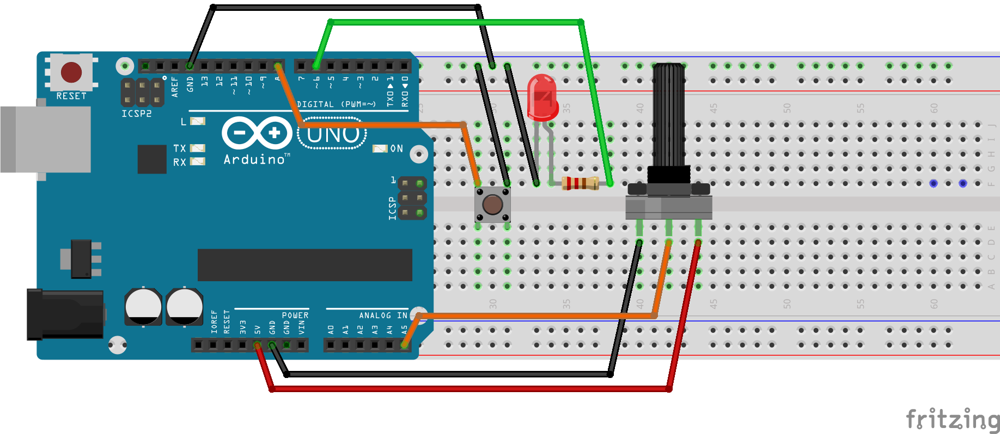

This project contains some sample code written while learning how to use features of the ATmega328p, such as PWM and the ADC.

The program incorporates a timer to poll for button input, PWM to dim an LED, and monitors an analogue signal from a potentiometer. 

Features are integrated together;
The program is designed to have the PWM duty cycle oscillate between 0% and 100% to gradually "blink" an external LED, ie. continuously dim and brighten it.
The potentiometer is set up to change the rate of this oscillation.
And the mechanical button disables the PWM, turns off the external LED, and enables the Arduino's onboard LED.
A circuit schematic is provided with the component configuration that will work with the code.

